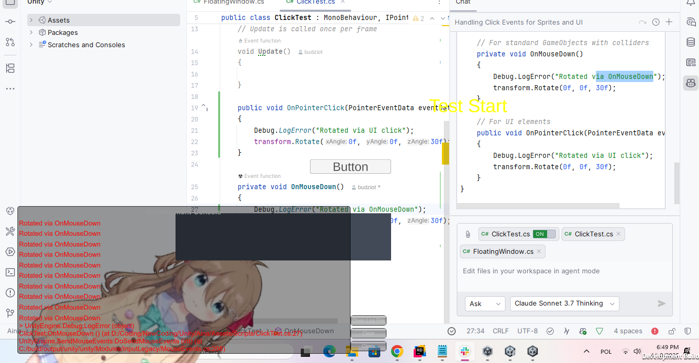

## Start of my journey
I always wanted to bult an AI assistant. My first try was with pure Rust around a year ago, and it ended up with me giving up after 
voice recognition stopped working (even though it worked in Python).</br>
What motivated me even more to build it were [Neuro-Sama](https://www.youtube.com/@Neurosama/featured) as well as [Project Airi](https://github.com/moeru-ai/airi).

### Choice of tools
I wondered... what can I use to build it? I tried using Rust earlier, it was enjoyable but failed quickly. Python would be too usual and I'm not too Python of a guy (at least for now) </br>
Using some React Native would be fun, but again - didn't want to try it. <br><br>
This is where I thought of... using a game engine! It is more heavy on the machine, but a lot of tools are already built in
and there shouldn't be any problems with learning curve - since I already love to build games.<br><br>
This is where another choice appeared - Unity or Godot (Unreal Engine beats my machine, I haven't used any other engines).<br>
I know Godot the most, but Unity beats it at the time of writing this with how many tools for TTS, STT and other already well prepared tools it has.

### Time to get to coding
I've done some research on what engine to use, on future tools I will use, but what now? <b>It's time to code!</b><br><br>
So... how do I make a transparent window? Let's take a look at [this video](https://www.youtube.com/watch?v=RqgsGaMPZTw)!

## Issues
Yeah, that video uses old version of Unity and nothing works at all. Great start. Seems like Unity doesn't allow transparent windows
by itself, and you need to use native API for every type of platform (good luck for me with later moving this project to other OS)<br>
Seemed easy at first, just include some native imports as
```csharp
[DllImport("User32.dll")]
private static extern int SetWindowLong(IntPtr hWnd, int nIndex, uint dwNewLong);
```
And it should work. It didn't though...<br>
I've looked for answers online and found some issues to resolve screen showing as black instead of transparent. Great going!<br><br>

### More issues
So... how to pass through clicks... Of course the solution from the video is broken (actually there were 2 solutions and first one isn't, but it makes sprites look really pixelated) <br>
I've further written code, researched online - nothing helped. Suddenly I started debugging it and... I've noticed how Unity crashes when you debug in the editor, cause of usage of transparent window...<br><br>
<b>5 hours have passed</b>, I even started to use AI out of desperation.</br>
During this my screen started to turn into a mess from all the testing:
> I was really desperate okay, I tested moving elements, had a debbuging text as a label and far more


> Neuro, you got boinked into the head with some block...



Finally, I added magical
```csharp
SetWindowLong(windowHandle, GWL_EXSTYLE, (currentStyle | WS_EX_LAYERED) & ~WS_EX_TRANSPARENT);
Debug.LogError($"Window style set to: {(through ? "click-through" : "normal")}");
```
I just turned bit operations into different ones and Logged a lot of stuff... You can say that Debug.LogError almost fixed my code
<br><br>
And... <b>It worked!</b> I could finally click through anything on the screen besides visible objects. Success!
[](https://hc-cdn.hel1.your-objectstorage.com/s/v3/769381595577d2c4726db3f503f77656ea538731_clickingworks.mp4)


## Live2D! (models)
Okay, so with that covered, I had to learn how to use Live2D in Unity.<br>
Looking at pricing threw me out of my chair, video tutorials even more, but fortunately everything like that was about the Live2D Cubism program, not SDK.<br>
SDK is actually much easier to use, which I'm really thankful for.

### Language barrier
I haven't mentioned earlier, but... I've been researching many Japanese sites to search for solutions to previous issues or to get info about Cubism<br>
This of course resulted in Google providing me weird translations which totally didn't make any sense, but... somehow we've made it through.<br>
> I'm learning Japanese, but I'm far away from being that good to understand this content

### Turning model into reality
Okay, I grabbed first Neuro model (actually called Hiyori) since it was available in free samples.<br>
Now... why the heck was this so small. I was confused as heck, but fixed that quickly</br>
Then I was fighting with it not showing up in editor (for the future: you need to run the game in Unity game view at first for it to start appearing, I was just always playing the build version)


### Some nice movement
Importing animations was easy, I gave it idle one but looping sucked. I improved the looping, but it was too repetitive, so I just turned it off.<br>
Then it was... weirdly eerie. The character just looked at one place, and did nothing more.<br>
This is where I handled blinking and breathing. It made it much more enjoyable!

### Looking at cursor
Okay, that is something that I will let people turn off and on depending on preferences, but I wanted to get it done quickly.</br>
I fought with it for the next ~3 hours. The original code from [the official site](https://docs.live2d.com/en/cubism-sdk-tutorials/lookat/) worked, but when character was out of the origin point (0, 0, 0) - it was broken.
<br><br.
I went through countless debugging sessions, lots of changes and finally, I made some adjustment including addition of sensitivity field and making it work.<br>
How I made it work? Just... set the character's ``CubismLookController`` Center property to its face.<br> <b>That was too simple and I fought with it so much...</b>
[](https://hc-cdn.hel1.your-objectstorage.com/s/v3/49c9d3a7d214c48e3dddec6a22b8893cb1e8004c_finalweek1.mp4)

## What's next?
That was it for the week one, but next I want to do:
- Ability to move the character around
- Make character fade when hovering over it, unless some shortcut was entered
- Buttons for: menu, chat
- Maybe start making chat "window"

Thanks for reading and see ya next time, hopefully I can get this to work soon and have someone to train languages with ; p<br>
See ya!
