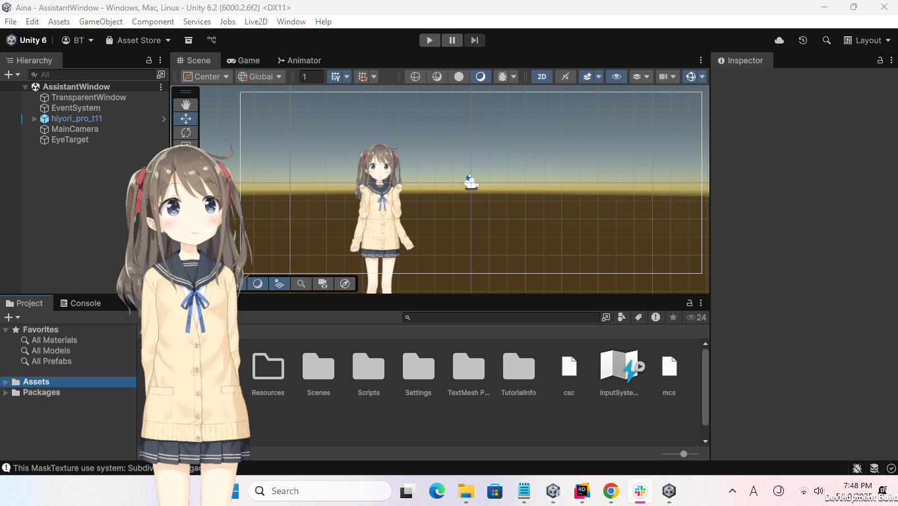

<h1 align="center">Aina</h1>

Your 3D model AI assistant, or just a waifu...

> Inspired by inspired by [Neuro-sama](https://www.youtube.com/@Neurosama) and [Project Airi](https://github.com/moeru-ai/airi)

Okay, I won't make this long, at the moment this project is almost nothing, but I'm gonna make a beautiful readme once we get more stuff working

> Works only on Windows right now!

<h2> So... what works now? </h2>

- Transparent window, that was hella hard to make in Unity
- One model that breaths and... blinks
- Following cursor with eyes (cause it seems weirdly eerie when the character doesn't move, I might throw some movement later for idle)

<h2> What's the plan? </h2>
- Make a fully free AI assistant/waifu with various APIs or local solutions to choose from
- Make it interact with you & with react on your actions, maybe perform something on your computer
- Respond both in text and in voice, depending on which one you prefer
- Ability to talk to it
- More models!
- Slack/Discord bot
- Website both landing and for normal usage of this Aina instead of running locally
- Mobile version
- Much much more...

<h2> Near incoming features, prolly for week 2 development: </h2>
- Dragging model around
- Fading model when hovering over it, ability to turn off fading by some key combo
- Chat screen

### I recommend you to read my Journal for more info about my journey
[Journal](Docs/Content/Journal)